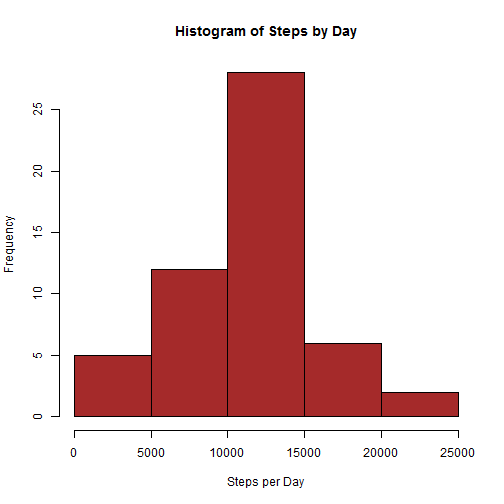
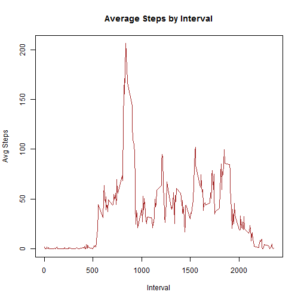
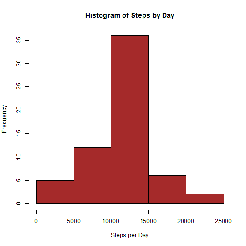

**Loading and Preprocessing the Data**


```r
activity <- read.csv("activity.csv")
```

1. What is mean total number of steps taken per day? Below gives a total of steps per day


```r
stepsbyday <- aggregate(steps ~ date, data = activity, sum)
stepsbyday
```

```
##          date steps
## 1  2012-10-02   126
## 2  2012-10-03 11352
## 3  2012-10-04 12116
## 4  2012-10-05 13294
## 5  2012-10-06 15420
## 6  2012-10-07 11015
## 7  2012-10-09 12811
## 8  2012-10-10  9900
## 9  2012-10-11 10304
## 10 2012-10-12 17382
## 11 2012-10-13 12426
## 12 2012-10-14 15098
## 13 2012-10-15 10139
## 14 2012-10-16 15084
## 15 2012-10-17 13452
## 16 2012-10-18 10056
## 17 2012-10-19 11829
## 18 2012-10-20 10395
## 19 2012-10-21  8821
## 20 2012-10-22 13460
## 21 2012-10-23  8918
## 22 2012-10-24  8355
## 23 2012-10-25  2492
## 24 2012-10-26  6778
## 25 2012-10-27 10119
## 26 2012-10-28 11458
## 27 2012-10-29  5018
## 28 2012-10-30  9819
## 29 2012-10-31 15414
## 30 2012-11-02 10600
## 31 2012-11-03 10571
## 32 2012-11-05 10439
## 33 2012-11-06  8334
## 34 2012-11-07 12883
## 35 2012-11-08  3219
## 36 2012-11-11 12608
## 37 2012-11-12 10765
## 38 2012-11-13  7336
## 39 2012-11-15    41
## 40 2012-11-16  5441
## 41 2012-11-17 14339
## 42 2012-11-18 15110
## 43 2012-11-19  8841
## 44 2012-11-20  4472
## 45 2012-11-21 12787
## 46 2012-11-22 20427
## 47 2012-11-23 21194
## 48 2012-11-24 14478
## 49 2012-11-25 11834
## 50 2012-11-26 11162
## 51 2012-11-27 13646
## 52 2012-11-28 10183
## 53 2012-11-29  7047
```

2. If you do not understand the difference between a histogram and a barplot, research the difference between them. Make a histogram of the total number of steps taken each day.

Below is a histogram of the Steps by Day:


```r
hist(stepsbyday$steps, main = "Histogram of Steps by Day", xlab = "Steps per Day", col = "brown")
```

 

3. Calculate and report the mean and median of the total number of steps taken per day


```r
mean(stepsbyday$steps)
```

```
## [1] 10766.19
```

```r
median(stepsbyday$steps)
```

```
## [1] 10765
```


**What is the average daily activity pattern?**

1. Make a time series plot (i.e. type = "l") of the 5-minute interval (x-axis) and the average number of steps taken, averaged across all days (y-axis).

First, I need to aggregate steps by interval:


```r
stepsbyinterval <- aggregate(steps~interval, data = activity, mean)
```


Next, I will make the plot:


```r
plot(stepsbyinterval,type = "l", main = "Average Steps by Interval", xlab = "Interval", ylab = "Avg Steps", col = "brown")
```

 


2. Which 5-minute interval, on average across all the days in the dataset, contains the maximum number of steps?

Determine the max of my "stepsbyinterval" data frame. I am going to check what the max is, then filter for the max using dplyr to find the row

```r
max(stepsbyinterval$steps)
```

```
## [1] 206.1698
```

```r
library(dplyr)
filter(stepsbyinterval, steps >= 206.1698)
```

```
##   interval    steps
## 1      835 206.1698
```

**Imputing missing values**


1. Calculate and report the total number of missing values in the dataset (i.e. the total number of rows with NAs)


```r
sum(is.na(activity))
```

```
## [1] 2304
```

2. Devise a strategy for filling in all of the missing values in the dataset. The strategy does not need to be sophisticated. For example, you could use the mean/median for that day, or the mean for that 5-minute interval, etc.

I already have stepsbyinterval, so I will use that to replace the data in activity with the mean of interval. 

I was having trouble with the for loop, so I used some pieces from the website below:

http://rstudio-pubs-static.s3.amazonaws.com/17469_4fbb71c305ba4a25a40eba1f8cdbb3e9.html

The forloop below creates a numeric vector called fillnas.
The loop then goes through the activity sheet, and if the steps are NA, it subsets the stepsbyinterval dataframe to get the average steps per interval.
If no NA, it uses the existing steps values.
It then creates a vector where the NA values are replaced and assigns this to the newdata data frame.
Vi


```r
fillnas <- numeric()
for(i in 1:nrow(activity)){
    rows <- activity[i,]
    if (is.na(rows$steps)){
        steps <- subset(stepsbyinterval, interval == rows$interval)$steps
        }else{
            steps <- rows$steps
        }
        fillnas <- c(fillnas, steps)
        
    }
```

3. Create a new dataset that is equal to the original dataset but with the missing data filled in.


```r
    newdata <- activity
    newdata$steps <- fillnas
```

4. Make a histogram of the total number of steps taken each day and Calculate and report the mean and median total number of steps taken per day. Do these values differ from the estimates from the first part of the assignment? What is the impact of imputing missing data on the estimates of the total daily number of steps?

Aggregate the data from the newdata

```r
newdatastepsbyday <- aggregate(steps ~ date, data = newdata, sum)
newdatastepsbyday
```

```
##          date    steps
## 1  2012-10-01 10766.19
## 2  2012-10-02   126.00
## 3  2012-10-03 11352.00
## 4  2012-10-04 12116.00
## 5  2012-10-05 13294.00
## 6  2012-10-06 15420.00
## 7  2012-10-07 11015.00
## 8  2012-10-08 10766.19
## 9  2012-10-09 12811.00
## 10 2012-10-10  9900.00
## 11 2012-10-11 10304.00
## 12 2012-10-12 17382.00
## 13 2012-10-13 12426.00
## 14 2012-10-14 15098.00
## 15 2012-10-15 10139.00
## 16 2012-10-16 15084.00
## 17 2012-10-17 13452.00
## 18 2012-10-18 10056.00
## 19 2012-10-19 11829.00
## 20 2012-10-20 10395.00
## 21 2012-10-21  8821.00
## 22 2012-10-22 13460.00
## 23 2012-10-23  8918.00
## 24 2012-10-24  8355.00
## 25 2012-10-25  2492.00
## 26 2012-10-26  6778.00
## 27 2012-10-27 10119.00
## 28 2012-10-28 11458.00
## 29 2012-10-29  5018.00
## 30 2012-10-30  9819.00
## 31 2012-10-31 15414.00
## 32 2012-11-01 10766.19
## 33 2012-11-02 10600.00
## 34 2012-11-03 10571.00
## 35 2012-11-04 10766.19
## 36 2012-11-05 10439.00
## 37 2012-11-06  8334.00
## 38 2012-11-07 12883.00
## 39 2012-11-08  3219.00
## 40 2012-11-09 10766.19
## 41 2012-11-10 10766.19
## 42 2012-11-11 12608.00
## 43 2012-11-12 10765.00
## 44 2012-11-13  7336.00
## 45 2012-11-14 10766.19
## 46 2012-11-15    41.00
## 47 2012-11-16  5441.00
## 48 2012-11-17 14339.00
## 49 2012-11-18 15110.00
## 50 2012-11-19  8841.00
## 51 2012-11-20  4472.00
## 52 2012-11-21 12787.00
## 53 2012-11-22 20427.00
## 54 2012-11-23 21194.00
## 55 2012-11-24 14478.00
## 56 2012-11-25 11834.00
## 57 2012-11-26 11162.00
## 58 2012-11-27 13646.00
## 59 2012-11-28 10183.00
## 60 2012-11-29  7047.00
## 61 2012-11-30 10766.19
```

Make the histogram with new aggregated data

```r
hist(newdatastepsbyday$steps, main = "Histogram of Steps by Day", xlab = "Steps per Day", col = "brown")
```

 

Determine Mean and Median:

```r
mean(newdatastepsbyday$steps)
```

```
## [1] 10766.19
```

```r
median(newdatastepsbyday$steps)
```

```
## [1] 10766.19
```

**Are there differences in activity patterns between weekdays and weekends?**


1. Create a new factor variable in the dataset with two levels – “weekday” and “weekend” indicating whether a given date is a weekday or weekend day.

First, I need to convert date to a date


```r
activity$date <- as.Date(activity$date)
```

Then, I will create the new variable and use a for loop to populate it. This creates an object called dayname that uses weekdays function to name the day based on date.
Then, an empty vector is created called daytype. The loop will be used to assign a value of weekday or weekend based on the day of the week (Monday, Tuesday, etc.)
The vector is filled and then added as a new variable in the Activity dataset.

Again, I could not have done this for loop without help from the website below:

http://rstudio-pubs-static.s3.amazonaws.com/17469_4fbb71c305ba4a25a40eba1f8cdbb3e9.html


```r
dayname <- weekdays(activity$date)
daytype <- vector()
for (i in 1:nrow(activity)) {
    if (dayname[i] == "Saturday") {
        daytype[i] <- "Weekend"
    } else if (dayname[i] == "Sunday") {
        daytype[i] <- "Weekend"
    } else {
        daytype[i] <- "Weekday"
    }
}
activity$daytype <- daytype
activity$daytype <- factor(activity$daytype)
```


2. Make a panel plot containing a time series plot (i.e. type = "l") of the 5-minute interval (x-axis) and the average number of steps taken, averaged across all weekday days or weekend days (y-axis). See the README file in the GitHub repository to see an example of what this plot should look like using simulated data.


```r
stepsbydaytype <- aggregate(steps~interval + daytype, data = activity, mean)
library(lattice)
 xyplot(steps ~ interval | daytype, stepsbydaytype, type = "l", layout = c(1, 2), 
           xlab = "Interval", ylab = "Number of steps")
```

 
